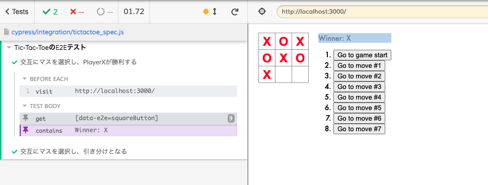
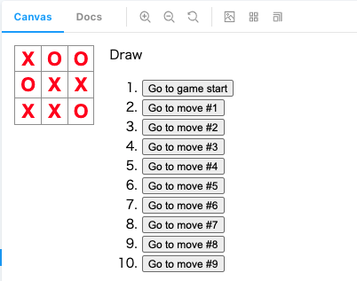

# E2E テストを書こう

## 課題内容

[airtable](https://airtable.com/tblTnXBXFOYJ0J7lZ/viwyi8muFtWUlhNKG/rec0AYtjGREPetZL4?blocks=hide)

## 課題 1(実装)

```bash
yarn cypress:open
```

### 1. 片方のユーザが勝利



### 2. 引き分け時の Draw 表示

引き分け状態の Story


### 3. 引き分け状態の e2e


---

## 課題 2(質問)

### メリデメ

- メリット
  - 手動テストと比較して自動テストのため、実行コストが低い
  - ボタンクリックなどのアクションイベントも検証可能
  - ユーザーストーリを検証できる
- デメリット

  - 実行速度が遅い
    - Unit Test と異なり、実際に外部通信が発生するため
  - 実行結果が不安定
    - 外部通信の結果に依存しているため

- 参考文献
  - [E2E テスト(インテグレーションテスト)の利点と不利点](https://qiita.com/NAKKA-K/items/58d6b8476a3717179bda)
  - [E2E テストの導入から学んだこと](https://qiita.com/mt0m/items/7e18d8802843d9f60d28)

### テスト手法の比較

- 実行速度 (遅い < 速い)
  - E2E < 結合 < 単体
- コスト (低い < 高い)
  - 単体 < 結合 < E2E
- 壊れやすさ (壊れにくい < 壊れやすい)
  - 単体 < 結合 < E2E
- 依存度 (低い < 高い)
  - 単体 < 結合 < E2E
- カバー範囲 (狭い < 広い)
  - 単体 < 結合 < E2E
- ユーザーシナリオを想定できているか

  - 単体 < 結合 < E2E

- [Just Say No to More End-to-End Tests](https://testing.googleblog.com/2015/04/just-say-no-to-more-end-to-end-tests.html)

## 課題 3(クイズ)

### クイズ 1

新人 F くんに、
「単体試験はロジックしか確認できないし確認できる範囲も狭いので、全部 E2E 試験で確認しちゃいけないんですか？」
と尋ねられました。
あなたなら、どのような説明を新人 F くんにしますか？

<details><summary>回答</summary><div>

- そもそも、テスト目的が異なる。
  - 単体試験は、各モジュールが正しい挙動をするか確認するために実施する。
  - E2E 試験は、実際のユーザーシナリオが正しい挙動をするかを確認するために実施する。
- E2E 試験だけだと、ユーザーシナリオが正しいことしか担保できない。そのため、各モジュール間の挙動が正しいかはわからない。
- 単体試験は各モジュールの挙動が正しいことを担保するだけではなく、各モジュールの責務をシンプルにする役割も兼ね備えているため必須である。
- また、E2E 試験は壊れやすく実行速度も遅いため、全てを E2E 試験で網羅することは現実的ではない。

</div></details>

### クイズ 2

立て続けに新人 F くんから
「じゃあ、E2E のテストケースはどのような優先順位で行いますか？」
と質問されました。
あなたなら、どのような説明をしますか？

<details><summary>回答</summary><div>

- ユーザーシナリオの重要度の高い順
- 判断基準は、このユーザーシナリオが失敗したらサービスの意義に関わるかどうか

* [E2E テストについて考えてみた](https://blog.mmmcorp.co.jp/blog/2017/03/10/E2ETest/#outline__3_2)
</div></details>

### 読んだ記事

- [id や class を使ってテストを書くのは、もはやアンチパターンである](https://qiita.com/akameco/items/519f7e4d5442b2a9d2da)
- [結合テストと呼ぶのをやめた話](http://akito0107.hatenablog.com/entry/2018/08/27/190333)
- [Test Sizes](https://testing.googleblog.com/2010/12/test-sizes.html)
